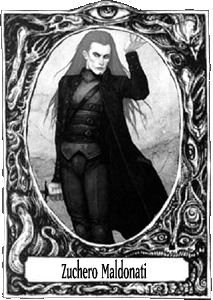

# Ubicaciones

Usar arte de wraith
http://www.inthenameofgoth.com/loggiaestigia/elladooscuro/antagonistas/benandanti.htm

Venecia
- En Venecia se ha montado una cábala que agrupa a toda escuela de magia. Normas de no agresion y no interferencia.
- Los líderes son Mercantes que están a favor de la presencia de magos siempre que ayude al comercio
- Hay historias de gûls y vampiros de la época.
- 12 Tribunos gobiernan la Ciudad Invisible. 
- La mayoría de los tribunos están ausentes y nadie dice nada. 
- Los mayos que alcanzan cierto poder desaparecen. Alguien de arriba no quiere que asciendan.
- Mürgen, Tamurello, Desdemona
- Black Death en 1347 y 100 de otras. En 1630 otra grande
- Isla de Poveglia
- https://en.wikipedia.org/wiki/The_Betrothed_(Manzoni_novel)
- Llueve practicamente cada día, todo lleno de barro, no se puede cultivar.
- Son la 1a alianza sin union a otras tradiciones. Una Alianza Libre.
- Triaca es una medicina que venden para combatir la plaga. Totalmente inutil. Pero los gûl se aprovechan
- Haufdorf trabaja aqui
- Una Mercader del Sindicato también
- CUando llueve la tierra se ablanda y los gûls tienen mas movilidad.
- Por eso Venecia es un centro importante para ellos.
- Venecia capital de la belleza
- Nexus de la diplomacia internacional
- La Gran Belleza
- https://es.wikipedia.org/wiki/Plaga_Italiana_(1629-1631)
- https://en.wikipedia.org/wiki/Friulian_literature

## La grande bellezza

5 - Los Gûl son una raza de prehumanos. Fueron perseguidos y casi exterminados por los primeros humanos. Expulsados a las tierras heladas sobrevivieron. Intercambiando sus hijos por humanos pasarón a la clandestinidad. Desde entonces viven ocultos de los ojos mortales. Son muy celosos de sus secretos y no toleran que nadie los descubra. El momento de los gûl ha llegado. Una nueva religión les ofrece un camino de salvación donde ellos serán amos y señores y la humanidad ganado.
La Guerra de los Treinta Años acaba de comenzar, es su gran plan. Se consideran descendientes de Cronos. Zeús fue un mago que lo mató. Los diosos ctóticos y sus rituales son la religión que practican. Una Profetisa estilo Juana de Arco enseña a los gûlssu nueva religión, el que forman parte de una comunidad y que están destinados a gobernar el mundo como antaño.

  - Su religión está vinculada a la figura de Orfeo. Lo consideran su profeta.

  - Orfeo esel fundador de los tradicionalistas entre los gûls. He is claimed by Aristophanes and Horace to have taught cannibals to subsist on fruit, and to have made lions and tigers obedient to him.

4 - Los gûl están creando una red de ciudades subterraneas desde donde gobernar al mundo. Su capital se conoce como Nueva Jerusalem. Están desentrañando los secretos de su raza que se han perdido. Se les conoce como gûls en arabia, fomori en Irlanda y también como atlantes. Fueron los Magos quienes les arrebataron sus secretos y se los hicieron olvidar. Los Magos les arrebataron todo. Ahora vuelven con ganas de venganza. Buscan libros con el conocimiento prohibido. 

  - Los túneles se extienden por toda Europa conectando las principales rutas. Los gûls llaman a estos túneles las Venas.

  - Nosotros somos la Sangre y vosotros sois la Carne.

  - Las Venas están protegidas por Pesadillas y trampas mundanas. En las profundidades de todo se encuentra Nueva Jerusalem donde adoran a la Madona, una niña de 13 años de gran poder. Cuando lleva 1 año en el poder es sacrificada y comida en una eucaristía. Es sustituida por otra. Los Sumos Sacerdotes controlan el proceso.

  - Los gûl son muy de hacer humor macabro. Así por ejemplo la Doncella de Nueva Jerusalem es unaniña humana raptada a la que fuerzan a hacer cosas y se ríen de ella.

  - Un grupo se dedica a vengarse de los humanos. La Hermandad de Grendel. Su lema es "Recuerda a Grendel". Es la versión de los caballeros templarios en gûl.

  - El Maestro de Esgrima. Un gûl experto en el uso de la espada. Enseña a nobles. Espíritu revolucionario.

  - Hacer que gûls sean amigos/colaboradores de los pjs. Que proclaman su inocencia, que no saben nada de los complots, que creían que eran amigos.

  - Mercader protestante, liante como Bert en Muerte entre las Flores.

  - Les molesta la luz intensa pero son capaces de disimilar.

  - Los gûls fueron engañados por el Infierno. Les enseño los secretos de la magia a cambio de corromperlos. Los humanos esclavizados les robaron los secretos de la magia y los derrocaron y persiguieron. Los gûl no olvidan y por ello persiguen a los diabolistas y demonios. Sin embargo, la marca de la corrupción persigue a su estirpe.

  - Los gûls de la Restauración persiguen a los Hijos de Orfeo. La Restauración proponen que los gûls ocupen su lugar de poder en el universo. Los Hijos de Orfeo creen posible una convivencia entre güls y humanos.

  - Tienen una lengüa propia basada en gruñidos y sonidos varios que utilizan para hablar entre ellos.

  - Encuentran un libro escrito en código. Si lo descifran es un libro de como cocinar humanos. Cocina para gente selecta. Estilo VOlkonich. Entre las recetas pueden encontrar como cocinar un mago para llevarse sus poderes, como recuperar conocimientos de cadáveres o llevarse su fuerza o destreza. Los Maestros Cocineros son muy apreciados porque son capaces de pasar el conocimiento y el poder de una generación a otra.
  El más famoso cocinero de Venecia que organiza banquetes a nobles y comerciantes por igual dispone de una cocina especial que es una cámara de torturas. Hay hace sus "hechizos". Tiene una escuela de cocina y multitud de sirvientes. Ha construido una red de espionaje en la ciudad.

  - Antes de llegar a las ciudades subterraneas hay salas con carcasas y huesos por todas partes. Son sus estercoleros.

  - Los gûls suelen ser artesanos y artístas de exquisita dedicación.

  - Cuando pillan la peste la gente oye voces. La memoria ancestral gûl.

  - Los gûl son apasionados y dedicados. En una situación extrema pueden usar fuerza de voluntad. Van hasta el final.

  - Se hacen llamar benandanti. Llaman a los humanos los malandanti

  - Practican Stregoneria (Brujería) 
  https://whitewolf.fandom.com/wiki/Sorcery_(WOD)
  https://en.wikipedia.org/wiki/Witches_of_Benevento

4 - Doissetep ya no está en la Tierra sinó en el Horizonte. Mürgen se retira del mundo para salvarlo. Se lleva los recursos mágicos y evita que los gûls los utilicen en su provecho. En Doissetep está la biblioteca de Alejandria de la magia. Es un manjar demasiado sabroso para los gûl. Con ese conocimiento podrían culminar su misión. Muy pocos saben que es el Horizonte. No la Tecnocrácia ni los Gûl lo saben. Doissetep se mantiene oculto como Gondolin e intenta salvar al mundo desde las sombras.

  - Vornheim como inspiración de Doissetep.

  - En la Sala del Trono hay un esqueleto de dragón completo.

4 - La Tecnocracia libra una guerra sin cuartel contra los gûl. No sabe quienes son y los gûl siempre se infiltran entre sus rangos. Finalmente invocan a un dios muy poderoso. La Máquina, tambien conocida como Deus ex Machina. Los gûl no son capaces de infiltrarse entre sus rangos y eso les permite ganar la batalla. Se transforman en autómatas y pierden la biología. También aparecen los Hombres de Negro. Inquisidores que se dedican a hacer limpieza.

   - The God Machine como inspiración de La Máquina.

   - La Tecnocracia se organiza en sociedas secretas estilo Rosacruces o Caballeros de Malta. Eso les permite tener recursos humanos.

   - A medida que pierden la guerra, por desesperación llevan a las criaturas maǵicas a la Máquina y transformarlos en sus sirvientes. Son transformados en Autómatas que son absolutamente realistas.

   - Un mago protean se dedica a criar todo tipo de animales para su uso. Caballos de guerra. Perros de combate. Sus perros son utilizados por las tropas tecnócratas.

3 - Una enorme Pesadilla protege Nueva Jerusalem de ser descubierta.

3 - En la guerra entre Magos y Gûls las hadas son cazadas y sus recursos robados. Optan por retirarse del mundo

3 - El valle donde está la Alianza de los jugadores es invadida por tropas imperiales. Se dedican a buscar brujas

3 - The books are written as a propaganda piece for the traditions, under the guise of creativity and freedom they espouse superstition and ignorance. The technocratic union is the logical conclusion of the Sorcerer's Crusade Order of Reason. Men in Black is a great example, the technocracy as protectors of humanity against unspeakable horrors.
Picture the traditions as the enemy, an Euthanatos cult, an Order of Hermes Conspiracy, a mad scientist Son of Ether who threatens to open a portal for something... The traditions are way cooler villains than protagonists.

3 - Alianza en el Valle de Cachite Castle. Donde gobernó La COndesa Bathory. El Castillo tiene una presencia imponente. Lugar infernal. El valle contiene lugares mágicos pero ha sido abandonado por la nobleza como lugar de mal augurio.

2 - Alianza de Nigromantes en las Catacumbas de Praga. Son realmente gûls.

2 - Haussdorf el Verditus Oscuro. Vive aislado en un castillo en las profundidades de la Selva Negra,rodeado de sus autómatas y sus armaduras animadas. Se dedica a cazar todas las hadas que puede para mantener a su Reino en pie.

  - Mientras van por un bosque se encuentran a unos caballeros organizando a una cazería y capturando hadas que se las llevan vivas.

  - Sus armaduras autómatas pueden servir para defenderse de los gûl y ofrece venderlas a cambio de materia prima.

  - Está aprendiendo a fabricar los que serán MarkI. Armaduras mecánicas de combate habitadas por una cabeza unicamente. Estan armaduras disponen de ingenios capaces de generar mucha fuerza y destrucción masica. Miden como 2'50. Tiene una cuba con un mercenario gigante noruego. Manteniendolo en stasis.

2 - La Orden de Dracul es un ala de losgabrielitas. Han caído bajo el infernalismo en su lucha contra los turcos. El Castillo de Drácula es un castillo infernal.

2 - Los inquisidores se enfrentan a los magos.

2 - Un grupo de magos de tradición proveientes de Doissetep organizan la resistencia.

1 - Las armas de la armería de la ciudad han desaparecido. Una investigación lleva a ver que han escavado un túnel y se lo han llevado todo por la noche.

1 - Bruja del bosque. Madre del Troll del Puente y Revientasesos. La Dama Pálida. Busca quedarseembarazada y después cambia los bebes. El bebe humano que se queda lo usa de esclavo para su choza.

1 - Tecnocracia tiene un orfanato donde educan a niños abandonados y sin futuros para transformarlos en futuros adeptos.

1 - Alberta da Guissano, es una tecnócrata que lleva una compañia de mercenarios. Es una condottiera.

1 - El khanato de Crimea se dedica a hacer raids importantes e interviene en el conflicto.

1 - Las catacumbas de Venecia guardadas por MilOjos.

1 - Roban un almacen con comida infectada, han sido los más pobres entre los pobres. Gûls ellos.

1 - Un hypocrates tiene guardado a la condesa Bathory que no se muere. Hace  experimentos con ella. Importante para saber de los gûls. Está en un centro de detencion en la region. Tiene mala fama entre los lugareños. Por algún motivo pjs descubren una ubicacion con actividades sospechosas.
https://en.wikipedia.org/wiki/Gradisca_d%27Isonzo

1 - Ottoman raid en la región de Friuli

1 - Misión de hacer Friuli más afín a venecia y limitar el feudalismo

0 - Los gûl son criaturas intensas. Les gusta el arte, la literatura, la música y las ciencias. Sienten un profundo síndrome de Stendhal ante la Belleza.

0 - Los gûl son macabros. Son casi siempre psicópatas, sociópatas. Les gusta causar daño ajeno.

0 - Los gûl suelen ser fanáticos religiosos y dogmáticos por naturaleza. Tampoco importa mucho la causa. Es una manera "social" que tienen de expresar su odio y rabia.

0 - Los gûl son practicamente inmunes al dolor y al sufrimiento. Comer carne humana les regenera y pueden recuperar miembros perdidos.

0 - Los gûl se orgnizan en clanes y familias. Son envidiosos, competitivos, crueles. Acatan órdenes a la vez que odian que alguien les mande.

0 - En unas tumbas encuentran un cuerpo de un miembro del consejo, pero el miembro del consejo sigue vivo.

0 - El Puente del Troll. Un puente viejo está protegido por un troll que pide un peaje. El troll es un gûl grande y fuerte que vive del bandidaje. De noche aparece y lo guarda. Vive en una pequeña cueva cerca del puente.

0 - La Torre del Revientasesos. Un Redcap que vive en una fortaleza quemada y derruida. Se dedica a arrojar piedras desde lo alto a desventurados viajeros. Hermano gemelo del Troll del Puente
    + Mientras son perseguidos por un grupo de tecnóratas son acorralados en la fortaleza abandonada

0 - Se encuentran un pueblo arrasado y gente colgada de un aŕbol por decenas. Uno de los cuerpos, un adolescente, se agita. Es un gûl de reciente creación que se encuentra muy confundido. Cree que tiene la Suerte de su lado y que puede salirse con la suya en cualquir cosa. Mezquino y rufían.

0 - Caballero en el Puente. Un puente está guardado por un caballero que reta a otros iguales a batirse con él. Está pagando una deuda con Dios. Fue cobarde en un momento crucial.

0 - Criaturas siniestras se agrupan en unas antiguas ruinas. Por ahora no hacen nada.

0 - Roban una caravana de los pjs para darselo a los pobres. Se hacen llamar los "bandidos mendicantes"

0 - Las tropas buscan a un pelirrojo y empiezan a detener a cualquiera así. No vuelven a aparecer

0 - Una razzia de turcos daña un pueblo vecino.

0 - La Orden Teutónica sigue existiendo y tiene poderosas tierras.

0 - Un miembro de la misma orden que un pj tiene un rifirafe con él y se inventa una farsa para retarlo a duelo.

0 - Un gûl organista. Le encanta el sonido de su órgano y tiene una obsesión con él. Ha descubierto que puede romper cosas y ahora investiga como puede afectar a la gente

0 - En algún lugar hay un agujero gigante que lleva a las profundidades.

0 - Un Teatro del Predicador. Gûl que predica una nueva religión apocalíptica con un teatro de marionetas.

0 - Un niño desentierra unos pájaros para comerselos tal cual. Mira a los pj y les saluda.

0 - Uno de los pj debe dinero a una banda de mafiosos. Le buscan para cobrar.

0 - Los Caballeros de Malta tienen su sede en Venecia. Gabrielitas.

0 - Un rico y vanidoso mercader dispone de un zoologico en medio de Venecia que todo el mundo le gusta visitar.

0 - Un castrati de opera ultra famoso y muy codiciado por almas oscuras es un ángel esclavizado.

0 - Llueve, llueve mucho. Todo lleno de barro y los campos no se pueden cultivar

0 - Se encuentran por la zona moth-butterfly. Un animal poco común.

0 - Los bosques de Friuli se están desforestando por las necesidades de la flota veneciana.

## Modules

- King for a day
- Black Death
- Better than any man
- Death Doom Love
- Dream Askew - small communities
- No Salvation for Witches
- Dogs in a Vineyard
- Apocalipsys World - Resources and clocks
- Vornheim
- Dark Hot Springs Island
- Gardens of ... aplicado al Bosque
- The Pale Lady
- Better than any man
- Guide to Kaiin
- Dying Earth Rpg

## Inspirations
- Los Señores del Acero
- El último valle
- Bathory
- La condesa
- Nightbreed
- The descend
- Wicked man
- La isla

## Tarot

Usar cartas del tarot como tabla de encuentros.
